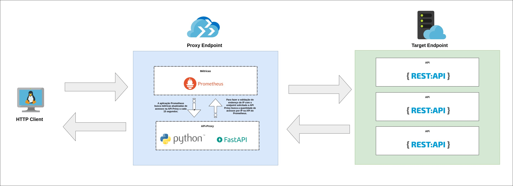

---

- **Documentation**: [https://fernandocelmer.github.io/api-proxy/](https://fernandocelmer.github.io/api-proxy/)
- **Source Code**: [https://github.com/FernandoCelmer/api-proxy](https://github.com/FernandoCelmer/api-proxy)

---

## Contexto do Projeto

Uma empresa possui atualmente +30.000 servidores onde suas aplicações são executadas. Elas comunicam-se entre si através de `APIs`, sendo que algumas possuem ainda acesso externo **(api.empresa.com)**.

## Problema

Um dos problemas é a dificuldade para medir e controlar interconexões entre as `APIs`.

## Solução

Implementação de um `proxy de apis` com os seguintes requisitos:

-  Executar a função de proxy sobre o domínio **api.empresa.com**, isto é, ele deve agir como um intermediário para as requisições dos clientes, enviando-as à **api.empresa.com**.
- Deverá permitir o controle das quantidades máximas de requisições por:
    - IP de origem
    - Path de destino
    - Combinações de ambos
- Deve armazenar (e também permitir que se consulte) as estatísticas de uso do proxy.
- O proxy (como solução) deverá poder superar 50.000 requisições por segundo.

## Commit Style

- ⚙️ FEATURE
- 📝 PEP8
- 📌 ISSUE
- 🪲 BUG
- 📘 DOCS
- 📦 PyPI
- ❤️️ TEST
- ⬆️ CI/CD
- ⚠️ SECURITY

## License

This project is licensed under the terms of the MIT license.
