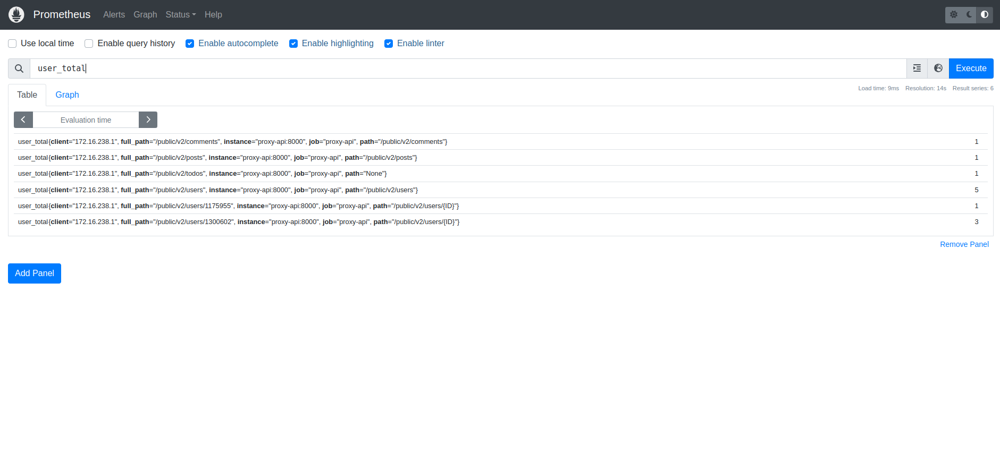

O Prometheus coleta e armazena suas métricas como dados de séries temporais, ou seja, as
informações das métricas são armazenadas com o carimbo de data/hora em que foram registradas,
juntamente com pares chave-valor opcionais chamados rótulos.

## Configurações

### Importação
Importar a classe **Counter**. Utilizada para realizar a contagem de acessos em
determinado endpoint da API.

```python
from prometheus_client import Counter
```

### Criação Função
Criar e especificar uma métrica, que será usado de controle para consulta no painel do Prometheus.

```python
metric_hello_world = Counter('v1_metric_hello_world', 'API', ['method'])
```

### Utilização
Incluir essa métrica no endpoint.

```python
@app.get("/")
async def root():
    metric_hello_world.labels(method="GET").inc()
    return {"message": "Hello World"}
```

## Painel

- Link: [http://127.0.0.1:9090/](http://127.0.0.1:9090/)

## Filtro

```
{job="proxy-api"}
```
