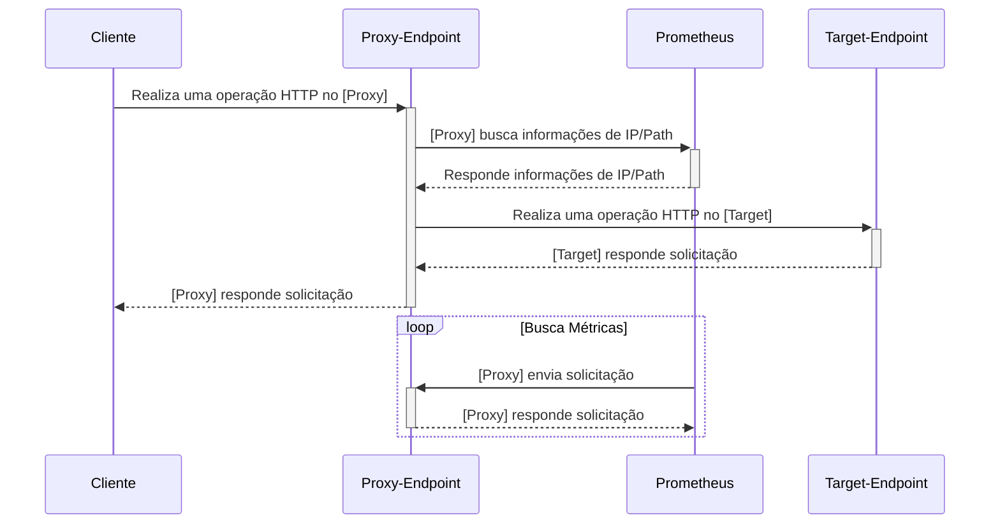

# Fluxo do Projeto

## Resumo

Basicamente o projeto todo se resume na comunicação entre duas aplicações que se dividem entre o processamento de solicitações `HTTP` e no armazenamento de métricas de usuários.

### API Proxy:

Responsável pela maior parte das operações envolvendo o `cliente` final que pode tanto ser serviços internos como externos. Esta `API` irá receber qualquer solicitação `HTTP` do `cliente` e realizará o processamento do mesmo que envolve:

- Validação de `Path`/`Endpoint` se existe nas configurações.
- Validação de `IP` referente ao `cliente` que está fazendo esta operação.
    - Se IP está cadastrado nas permissões.
    - Se existe vínculo entre `IP` <-> `Path`
    - Se já ultrapassou o limite de solicitação com base nas configurações do `cliente`.
    - Se já ultrapassou o limite de solicitação com base nas configurações do `proxy`.

### Prometheus

Responsável por fornecer a estrutura de armazenamento e plotagem de dados referente as solicitações HTTP do `Proxy`. Com o `Prometheus` é possível de forma bastante fácil e rápida visualizar os dados através de um dashboard e implementar integrações com outras plataformas através da `API`. 

Para manter os dados atualizados o `Promotheus` realiza solicitações HTTP ao `Proxy` de tempos em tempos para buscar as últimas métricas. O tempo entre cada solicitação é totalmente configurável, atualmente para este projeto está definido por padrão 15 segundos.
