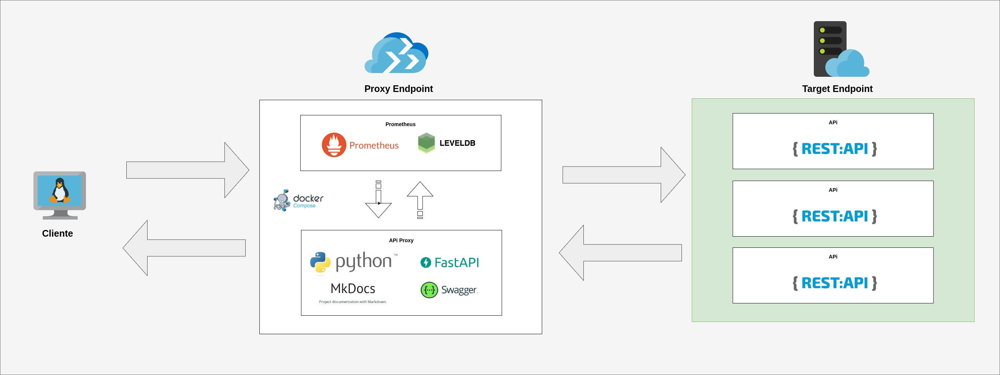

# Tecnologias e Ferramentas

## Linguagem Base

- [Python](https://www.python.org/)

## Framework Base para API

- [FastAPI](https://fastapi.tiangolo.com/)

## Banco de Dados

- [LevelDB](https://github.com/google/leveldb)

## Ferramentas de Documentação

- [Swagger](https://swagger.io/)
- [MkDocs](https://www.mkdocs.org/)

## Ferramentas de Monitoramento

- [Prometheus](https://prometheus.io/)