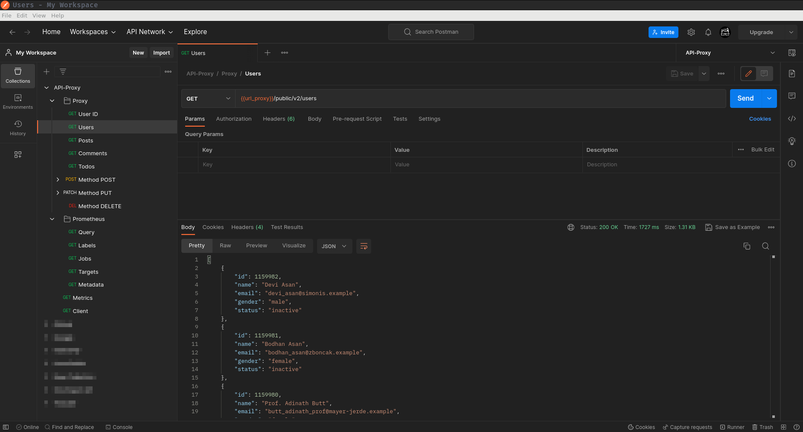

# Teste



Para o teste do projeto foi configurado uma série de `collections` que podem ser importadas no `Postman` para facilitar o envio de solicitações HTTP diretamente ao `Proxy` local com informações referente a `URLs` préviamente adicionadas e alinhadas ao projeto.

## Dependências

- [Postman](https://www.postman.com/)

| OS         | Package Manager  | Command                                |
|:---------- |:---------------- | :------------------------------------: | 
| linux      | Snappy           |  `sudo snap install postman`           |

## Arquivos

### Collection

#### Caminho no Projeto

```bash
api-proxy/docs/assets/postman_collection.json
```

#### Download Curl

```bash
curl https://raw.githubusercontent.com/FernandoCelmer/api-proxy/master/docs/assets/postman_collection.json -o postman_collection.json
```

### Environment

#### Caminho no Projeto

```bash
api-proxy/docs/assets/postman_environment.json
```

#### Download Curl

```bash
curl https://raw.githubusercontent.com/FernandoCelmer/api-proxy/master/docs/assets/postman_environment.json -o postman_environment.json
```